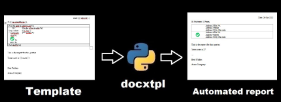
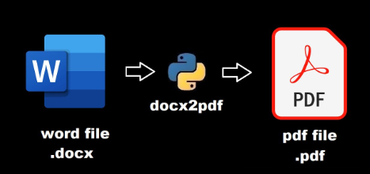
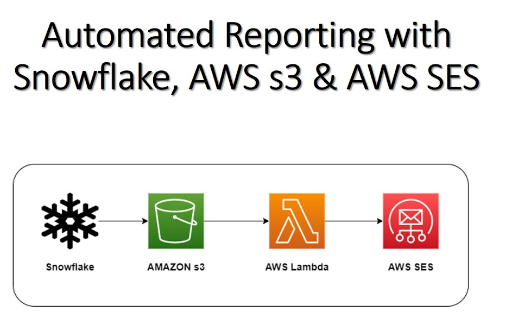

# Generador y Automatizador de Archivos Word y PDF.

  

  

  <iframe width="600" height="340" src="https://www.youtube.com/embed/encCkfkOxxI" frameborder="0" allowfullscreen></iframe>

## Índice.
1. [Descripción del Proyecto](#descripción-del-proyecto).
2. [Uso](#uso).
3. [Arquitectura del Proyecto](#arquitectura-del-proyecto).
4. [Ejemplo de Funcionamiento](#ejemplo-de-funcionamiento).
5. [Rendimiento](#rendimiento).
6. [Mejoras Futuras](#mejoras-futuras).
7. [Conclusión](#conclusion).

## 1. Descripción del Proyecto.
Este proyecto tiene como objetivo automatizar la generación de archivos Word y PDF a partir de plantillas y datos estructurados en Excel. Utiliza dos scripts (`script_generador.py` y `script_generator.py`) que crean archivos en español e inglés respectivamente.

## 2. Uso.
Asegúrate de tener los archivos 'doc_plantilla.docx', 'doc_template.docx' y 'data.xlsx' en el directorio raíz del proyecto.
Ejecuta el script deseado:
- python script_generador.py
- python script_generator.py

## 3. Arquitectura del Proyecto.

### Camino de los Datos.

- **Extracción (E)**:Se extraen datos de un archivo Excel (data.xlsx) usando pandas.

- **Transformación (T)**: Los datos son procesados y renderizados en una plantilla de Word utilizando docxtpl.

- **Carga (L)**: Los archivos Word generados se guardan y luego se convierten a PDF usando docx2pdf.

### Librerías Utilizadas.

- docxtpl: Utilizada para renderizar plantillas de Word con datos específicos.
- pandas: Usada para manipular y leer datos de archivos Excel.
- docx2pdf: Utilizada para convertir archivos .docx a .pdf.

## 4. Ejemplo de Funcionamiento.
Ambos scripts comienzan con una plantilla (doc_plantilla.docx o doc_template.docx), leen datos desde un archivo Excel (data.xlsx), y para cada fila de datos:
- Renderizan un documento Word con los datos específicos.
- Guardan el documento en la carpeta correspondiente (Generated_docs/Español o Generated_docs/English).
- Convierten el documento Word a PDF y lo guardan en la misma carpeta.

## 5. Rendimiento.
El sistema genera un archivo (.docx y .pdf) aproximadamente cada 4 segundos en una computadora con un procesador Intel i7. Este rendimiento es adecuado para la generación de documentos en lotes pequeños y medianos. Con las mejoras futuras este proyecto es altamente escalable.

## 6. Mejoras Futuras.
Este proyecto tiene un gran potencial de mejora y expansión, incluyendo:

- **Conexión a API's**: Permitir la integración con APIs para generar archivos automáticamente desde diversas fuentes de datos.
- **Conexión a base de datos**: Permite la integración bases de datos (snowflake) para generar archivos.
- **Integración con Django**: Desarrollar una interfaz web para administrar y generar documentos desde un navegador.
- **Automatización con AWS**:
  - **AWS Lambda**: Utilizar AWS Lambda para procesar y generar documentos en la nube, permitiendo la automatización de miles de archivos por día con alta eficiencia y bajo costo.
  - **Amazon S3**: Almacenar documentos generados en Amazon S3 para un acceso seguro y escalable.
  - **AWS Step Functions**: Orquestar flujos de trabajo complejos para la generación y distribución de documentos.
  - **Amazon SES**: Utilizar Amazon SES para enviar automáticamente los documentos generados por correo electrónico.

  

## 7. Conclusión.
Este proyecto demuestra un claro proceso de ETL (Extracción, Transformación, Carga) para la generación automatizada de documentos. Con mejoras adicionales y la integración de servicios en la nube, puede convertirse en una herramienta poderosa para la automatización de tareas en diversas industrias.
